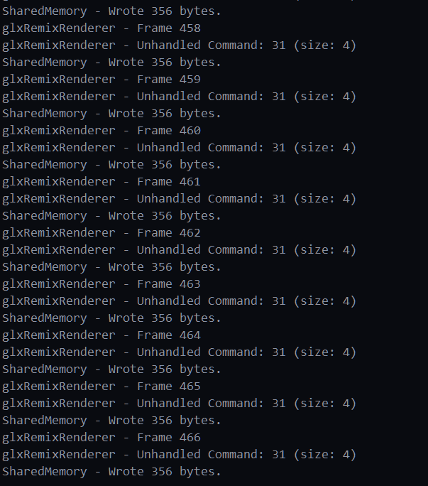

# Synchronization Dev Notes

IPC Milestone 2 Deliverables:

1. Event-based IPC synchronization
2. Double-buffered IPC interchange
    1. IMPORTANT: Never skip host app frame
3. Refactor to remove extra buffer used in shim via FrameRecorder

## Event Objects in Windows

`CreateEventW`: creates the initial event object. Initializes in a non-signaled state.
`WaitForSingleObject` & `WaitForMultipleObjects`: Blocks the calling thread until one or multiple events is signaled.

## Performance Analysis

### GLXGears

|         | Baseline | Original | Milestone 1 | Milestone 2 |
| ------- | -------- | -------- | ----------- | ----------- |
| Debug   | 1926.2   |          |             | 492.7       |
| Release | 1980.5   |          |             | 785.5       |

## Refactor Milestones

### Milestone 1

Commit URL: TBD

Refactor `IPCProtocol::send_frame` so that it does not allow progression of the thread until it has successfully written to shared memory.

This is done using `WaitForSingleObject` with the shared memory's read event member variable as the handle.

```cpp
DWORD dw_wait_result = WaitForSingleObject(m_smem.get_read_event(), INFINITE);
```

Shown below is the (rudimentary) debug log from the renderer with incrementing, non-skipping frames.


